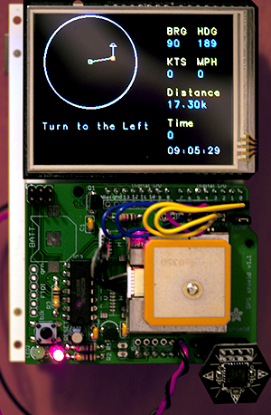

# Share
99% of what I write I cannot share as it's for clients burdened with NDA's and copyrights, but what I can share I'm going to start posting in this repo.

###Arduino/Chucks_GPS_2010.pde

-Built around an Arduino, it has a GPS, digital compass, logging to an SD card, a touchscreen and a lithium battery- and runs for about 14 hours on a charge.

This was built in 3 days before BurningMan 2010.  This is a working example of how I write code that I will probably be the only one viewing it.  Just enough to hopefully come back and figure out what I was doing.

###Arduino/I2C_Slave.ino

This is a WIP of a remote sensor platform running on an Arduino.  This is currently meant to monitor the battery health and use a Sainsmart relay to shutoff the battery if the charge falls below a critical rate.  This helps save expensive SLA batteries that I have in various remote / solar powered projects such as my APRS iGATE.

The Arduino(s) are to be controlled over an I2C bus from a Raspberry Pi which is running a web interface for all Arduinos out on the bus.

This is written in a style where I would foresee sharing it with others to extend.

- Monitors battery voltage through a voltage divider
- Monitors temperature and humidity with a [DHT22 Sensor](http://www.adafruit.com/products/385?gclid=CL-95abFpMQCFQenaQodpaQAVA)
- Controls the battery connection with a [Sainsmart relay](http://www.sainsmart.com/arduino-compatibles-1/relay.html)

###iOS/Convert

This was my first App Store release.  Currency converters are generally sneered at as a sample of work, but this was before the days of FMDB and AFNetworking.  I wanted to learn the system so I chose a product that would require local storage, a backend server, some art and localization.  I realize art isn't my deal but hey, I'm GREAT with an artist.  

This Code style is learning on the fly, trying to rush to the store for those early dollars and knowing I would be the only one ever reading it.  Well, until now.

